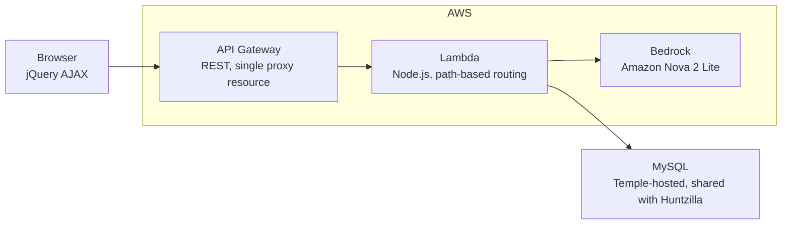
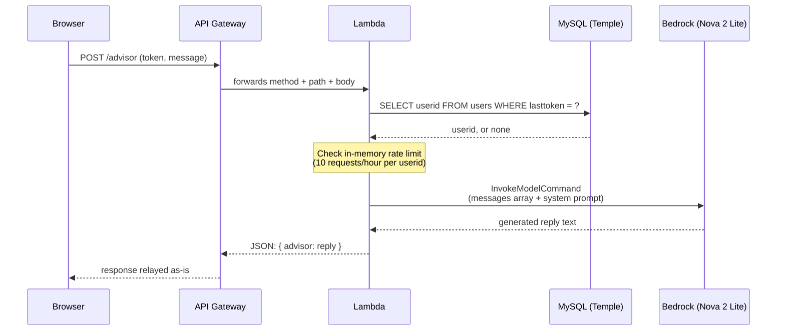

# Architecture

This document describes how a request actually moves through the system, building on the
context in [`BUSINESS_CASE.md`](BUSINESS_CASE.md). For a critique of specific decisions, see
[`CODE_REVIEW.md`](CODE_REVIEW.md) - this document stays descriptive.

## Deployment boundary

API Gateway, Lambda, and Bedrock are all AWS-managed. The database is the same Temple-hosted
MySQL instance Huntzilla uses - outside AWS, reached over the public internet.



## API Gateway configuration

Confirmed directly from the console (not inferred): a single REST API with a greedy proxy
resource, identical in structure to Huntzilla's setup:

```
/
  /advisor          <- ANY, OPTIONS
    /{proxy+}         <- ANY, OPTIONS
```

`{proxy+}` matches any path under `/advisor/`, and `ANY` matches every HTTP method - both
forward straight through to the Lambda with the real method and path attached, and the Lambda's
own routing function does the actual dispatch. Two Lambda trigger permissions exist (one for the
base resource, one for everything under it) because API Gateway grants invocation permission per
matching resource pattern, not once per Lambda:

```
arn:...:0n2iuenxuf/*/*/advisor         -> base resource
arn:...:0n2iuenxuf/*/*/advisor/*       -> everything under it
```

CORS is handled in two separate places, same pattern as Huntzilla:
- **Preflight `OPTIONS` requests** on `/advisor/{proxy+}` are answered directly by API Gateway's
  mock integration - confirmed via the console: `Access-Control-Allow-Headers`,
  `Access-Control-Allow-Methods`, and `Access-Control-Allow-Origin: '*'` are all set as header
  mappings on the integration response, with no mapping templates and no Lambda invocation at
  all for this method.
- **Actual GET/POST/PATCH/DELETE responses** carry `Access-Control-Allow-Origin` set manually
  inside the Lambda's own response object, in `handler()`.

## Request lifecycle: the AI advisor (the genuinely new part)

Auth and game routes (`login`, `signup`, `startgame`, `guess1`/`2`/`3`, `endgame`, `cancelgame`,
`leaderboard`) are byte-for-byte identical to Huntzilla - see that repository's `ARCHITECTURE.md`
for the full breakdown. The interesting new lifecycle is the advisor call:



The single `SELECT` shown above is the **entire** database interaction for this route - nothing
about the question or the answer is written anywhere. Same pattern for `/gpa` and `/budget`,
just with pure calculation instead of a Bedrock call after the token check.

## The AI model, and why it changed

Originally called `amazon.titan-text-lite-v1` via Bedrock's `InvokeModel` API, using a single
`inputText` string. AWS fully retired this model from the Bedrock catalog (see
`BUSINESS_CASE.md` for the incident). Migrated to **Amazon Nova 2 Lite**
(`us.amazon.nova-2-lite-v1:0`), which uses a structurally different request shape:

```javascript
// Request body
{
  messages: [{ role: "user", content: [{ text: "Student question: ..." }] }],
  system: [{ text: systemPrompt }],
  inferenceConfig: { maxTokens: 300, temperature: 0.6 }
}

// Response shape
output.output.message.content[0].text
```

The system prompt itself contains conditional logic: general questions get answered directly;
questions touching official policy, deadlines, academic probation, or immigration/visa rules get
answered plus a fixed disclaimer sentence appended ("Double-check this with Temple Academic
Advising"). This distinction is enforced entirely by prompt instructions, not code - the model
decides which category a question falls into.

## Client-side grounding: how GPA/budget context reaches the advisor

The advisor endpoint itself only ever receives a `message` string - it has no awareness of a
student's GPA or budget on its own. Grounding happens **before** the request is sent, in the
browser:

```javascript
// Simplified from askAdvisorAboutGpa()
let contextMessage = `My current GPA is ${currentGpa}... my projected GPA will be ${projectedGpa}. `;
contextMessage += "What should I consider to improve my academic performance at Temple?";
askAdvisor(contextMessage);
```

The actual numbers get woven into a natural-language sentence client-side, and that composed
sentence is sent as an ordinary `message`. The backend never merges structured context into
anything - it just receives a message that happens to contain real numbers.

## Rate limiting: two independent layers

**Client-side** (`js/app.js`): an array of timestamps (`advisorCallTimestamps`), filtered to the
last hour on every check, capped at 10. Blocks a request before it's even sent if the cap is hit.

**Server-side** (`server/index.mjs`): a module-level object (`advisorRateLimit`), keyed by
`userid`, same 10/hour logic. This is the backstop for anyone who bypasses the frontend entirely.
Because it's a plain in-memory object rather than a persisted store, it only survives across
invocations when Lambda happens to reuse a warm execution environment - under real concurrent
traffic or after a cold start, it resets silently. (Same underlying fragility as any in-memory
Lambda state - see `CODE_REVIEW.md`.)

## Cost ceiling: the actual math

Historical AWS Cost Explorer data for this project's original testing period fell outside the
tool's retention window by the time this was documented, so the `<$5/month` claim is stated here
as a **calculated worst-case ceiling**, not a verified invoice:

```
Worst case: one user hitting the rate limit every hour, all day, every day, for a month
10 requests/hour x 24 hours x 30 days = 7,200 requests/month
~300 input tokens + 300 output tokens per request = ~600 tokens/request
7,200 x 600 = 4,320,000 tokens/month (2.16M input, 2.16M output)

At Amazon Nova Lite-tier pricing (~$0.06 / $0.24 per million input/output tokens):
2.16M x $0.06/1M = $0.13  (input)
2.16M x $0.24/1M = $0.52  (output)
Total worst case, single user, maximum possible load: ~$0.65/month
```

Even this extreme, unrealistic upper bound - one person maxing the rate limit nonstop for an
entire month - lands well under $5. Real usage, spread across however many users actually tried
it, would be a small fraction of this. This also explains why the original design assumption
(built around the now-retired Titan Lite, priced in the same ultra-low tier) was safe from the
start.

## Authentication model: two separate validation paths

This project introduces a **second, deliberately separate** token-validation function rather
than reusing Huntzilla's existing (already inconsistent) logic:

| Function | Used by | Check |
|---|---|---|
| `getUserByToken` | `startgame` (inherited from Huntzilla) | Joins `users` to `logins` on token |
| Direct `users.lasttoken` check | `guess1`/`2`/`3`, `endgame`, `cancelgame` (inherited) | Checks `users.lasttoken` directly |
| `validateTokenBasic` | `gpa`, `budget`, `advisor` (new) | Checks `users.lasttoken` directly, returns just the `userid` |

The new function's own comment states its purpose directly: built to avoid touching or
destabilizing Huntzilla's existing auth paths while adding new functionality on top. No token
expiration exists in any of the three paths above.

## Routing table

| Method | Path | Status |
|---|---|---|
| POST | `login`, `signup` | Inherited from Huntzilla, unchanged |
| POST | `startgame` | Inherited, unchanged |
| PATCH | `guess1` / `guess2` / `guess3` | Inherited, unchanged |
| POST | `endgame` | Inherited, unchanged |
| DELETE | `cancelgame` | Inherited, unchanged |
| GET | `leaderboard` | Inherited, unchanged |
| GET | `debugusers` / `debuglogins` / `debuggames` / `debuggameprogress` / `debugleaderboard` | Inherited, unchanged |
| GET | `datetime`, `myname` | Inherited template example routes, unchanged |
| POST | `gpa` | New - pure calculation, one token check |
| POST | `budget` | New - pure calculation, one token check |
| POST | `advisor` | New - Bedrock call, one token check, in-memory rate limit |

## Connection lifecycle

Identical to Huntzilla: a new MySQL connection is opened in `handler()` at the start of every
invocation, and closed in `formatres()` before every response - no pooling, no reuse. Inherited
from the same course-provided template, not written for this project specifically.
